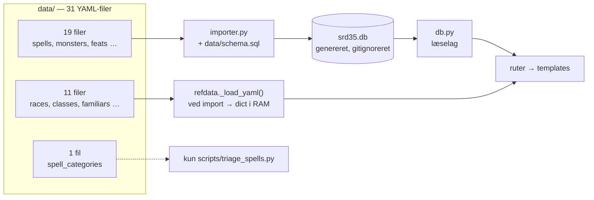
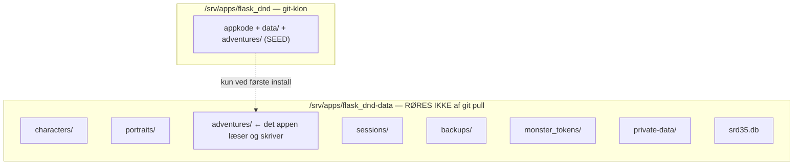
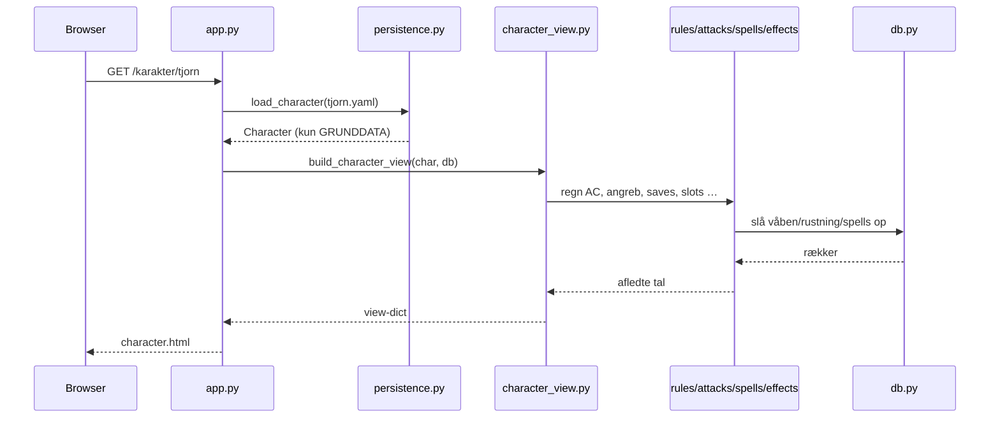

# Dataflow

Der er **to** veje fra en YAML-fil i `data/` til noget der vises på skærmen, og
de er nemme at forveksle. Vælger man den forkerte, når ens nye data aldrig frem.

## De to veje



### Vej 1 — gennem databasen (19 filer)

Store kataloger man slår **op** i: `spells`, `monsters`, `animals`, `feats`,
`weapons`, `items`, `traps`, `doors`, `effects`, `magic_items` med flere. De
seedes af `importer.py` til `srd35.db` og læses gennem `db.py`.

Kendetegn: mange rækker, tilgås med et id, og indholdet vokser løbende.

### Vej 2 — direkte i hukommelsen (11 filer)

Små regeltabeller der **altid** skal være der, og som læses ved modul-import
med `refdata._load_yaml()`:

| Fil | Læses af | Indhold |
|---|---|---|
| `races.yaml` | `refdata`, `creation`, `character_view` | Race-traits |
| `classes.yaml` | `refdata` | Hit die, skill points, klassefærdigheder |
| `starting_kits.yaml` | `refdata` | Anbefalet startudstyr pr. klasse |
| `familiars.yaml` | `refdata`, `familiar` | Familiar-typer og deres bonusser |
| `summon_lists.yaml` | `refdata` | Summon Nature's Ally I–IX |
| `summon_monster_lists.yaml` | `refdata` | Summon Monster I–IX |
| `creature_templates.yaml` | `refdata` | Skabeloner (celestial m.fl.) |
| `spell_notes.yaml` | `refdata` | 242 håndskrevne noter til spells |
| `combat_options.yaml` | `combat_options` | Kamp-toggles (Power Attack m.fl.) |
| `magic_abilities.yaml` | `magic_abilities`, `models`, `magic_gear` | Våben-/rustnings-egenskaber |
| `monster_token_aliases.yaml` | `monster_tokens` | Billed-token-navnemapping |

Kendetegn: få rækker, læses *hele* filen på én gang, og koden har brug for dem
før der er en HTTP-request.

!!! warning "Konsekvensen for dig"
    Retter du en af **vej 2**-filerne, slår ændringen igennem ved næste
    genstart af appen — der er **ingen reseed nødvendig**. Retter du en
    **vej 1**-fil, sker der intet før `importer.py` har kørt igen.

    Lokalt: `./run-local.sh --fresh`. På serveren:
    `sudo /srv/apps/flask_dnd/deploy/update.sh --force-seed`.

### Den ene fil der ikke bruges af appen

`data/spell_categories.yaml` læses **kun** af `scripts/triage_spells.py`. Det er
menneske-rettede kategori-beslutninger til spell-triagen, ikke driftsdata. Den
er nem at tro er aktiv — den er det ikke.

## Seedingen i detaljer

`importer.py` er bevidst tynd og fuldstændig generisk — der er ingen kode pr.
tabel:

```python
info = list(conn.execute(f"PRAGMA table_info({table})"))
cols = [r[1] for r in info]
stmt = f"INSERT OR REPLACE INTO {table} ({', '.join(cols)}) VALUES (…)"
rows = _load_rows(DATA_DIR / f"{table}.yaml")
```

Kolonnerne læses ud af databasen selv, efter at `schema.sql` er kørt. Derfor
kræver en ny tabel **ingen** ny indlæsningskode:

1. `CREATE TABLE` i `data/schema.sql`
2. `data/<tabel>.yaml` med rækkerne
3. Tabelnavnet føjet til `TABLES` i `importer.py`

Seedingen er idempotent: `schema.sql` starter med `DROP TABLE IF EXISTS`, så
databasen bygges fra nul hver gang. Det er trygt, fordi den **kun** indeholder
genereret referencedata — brugerdata ligger et helt andet sted (se nedenfor).

## Det private overlay

Efter hver `data/<tabel>.yaml` indlæses `$DND_PRIVATE_DATA_DIR/<tabel>.yaml`
hvis den findes. Samme skema, samme `INSERT OR REPLACE` — så privat indhold
ender i databasen på **fuldstændig lige fod** med SRD'et, og ingen opslagskode
kender forskel.

```python
rows    = _load_rows(DATA_DIR / f"{table}.yaml")
private = _load_rows(PRIVATE_DATA_DIR / f"{table}.yaml")
# Privat sidst: INSERT OR REPLACE lader overlayet vinde ved samme nøgle.
for row in rows + private:
```

Rækkefølgen er pointen: samme primærnøgle som en SRD-række **overskriver** den.
Det er tilladt, men seed'en printer `ADVARSEL`, så det aldrig sker uopdaget.

Stierne: lokalt `../dnd-private-data` (eget privat git-repo, søskende til dette,
sat af `run-local.sh`), på serveren `/srv/apps/flask_dnd-data/private-data/`
(sat af `deploy/update.sh`). Serverens overlay følger **ikke** med `git pull` —
læg filerne derop og kør `update.sh --force-seed`.

## Hvor brugerdata bor — ikke i repoet

Det her er den mest værdifulde skelnen i hele projektet, og den er let at få
galt i halsen: **repoets `adventures/` er en seed, ikke det appen læser.**



`paths.py` udleder alle brugerdata-stier af `CHARACTERS_DIR.parent`:

```python
CHARACTERS_DIR     = os.environ["DND_CHARACTERS_DIR"]   # sat af systemd-unitten
PORTRAITS_DIR      = CHARACTERS_DIR.parent / "portraits"
MONSTER_TOKENS_DIR = CHARACTERS_DIR.parent / "monster_tokens"
ADVENTURES_DIR     = CHARACTERS_DIR.parent / "adventures"
```

Redigerer du et eventyr i DM-modulet, lander det i **data-mappen** og aldrig i
git. Repoets `adventures/` indeholder `_TEMPLATE.md` og de eventyr der blev
committet som udgangspunkt — den er ikke en backup af et igangværende spil.

!!! danger "Backup af eventyr er dit eget ansvar"
    Fordi eventyr er brugerdata, dækker `git push` dem ikke. Et igangværende
    eventyr findes kun i `/srv/apps/flask_dnd-data/adventures/`.

## Hvordan et karakterark bliver til



Bemærk at der ikke er noget cache-trin, og at YAML-filen aldrig indeholder
totaler. Det er kerneprincippet — se [Regelmotor](regelmotor.md).
