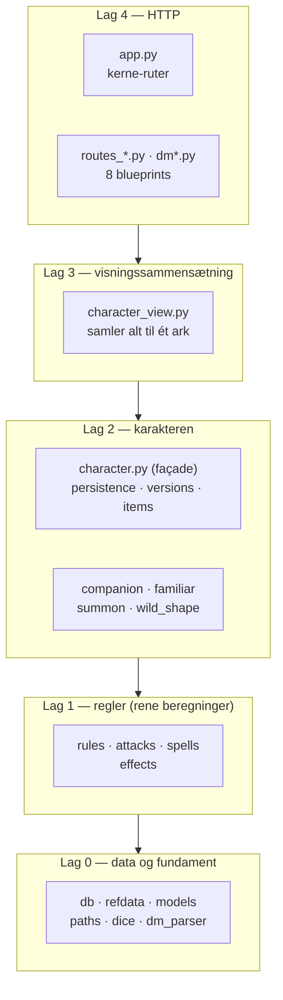

# Arkitektur

Al appkode ligger **fladt i repo-roden** — ingen `src/`, ingen pakke-mapper.
Det er et bevidst valg fra da ynh-laget blev fjernet 26. juli 2026, og det
virker fordi filerne er skarpt opdelt efter *ansvar* i stedet for efter mappe.

Den vigtigste indsigt om koden er ikke hvor filerne ligger, men at de er
**lagdelte**: de nederste lag ved intet om de øverste.

## Lagene



Reglen der holder det på plads: **lag 0 og 1 importerer ingen af de øvre lag.**
`refdata.py`, `models.py`, `db.py`, `paths.py`, `dice.py` og `dm_parser.py`
importerer *intet* fra repoet — de er blade i grafen. Derfor kan regelmotoren
testes uden Flask, og det er også derfor testsuiten kører 729 tests på ~30
sekunder.

De mest importerede moduler er dermed også de mest stabile:

| Modul | Importeret af | Ansvar |
|---|--:|---|
| `character.py` | 18 | Façade for karakter-logikken |
| `db.py` | 14 | Læse-adgang til `srd35.db` |
| `refdata.py` | 14 | Statiske regeltabeller (racer, klasser, kits) |
| `paths.py` | 9 | Hvor filer ligger + slug-sanitering |
| `effects.py` | 8 | Effekt-motor (buffs, tilstande) |

## Filkort

```
app.py               Flask-app + kerne-ruter (forside, karakterark, HP, rul, portræt)
routes_*.py          Blueprints: combat, companion, inventory, progression, spells,
                     summon, versions
dm*.py               DM-modulet (16 filer: bræt, encounter, scene, session, parser, media)

character.py         Façade → persistence + rules + attacks + spells + effects + items
character_view.py    Bygger hele arkets visningsdata (kaldes af /karakter/<navn>)
rules.py             Skills, saves, AC, XP, bæreevne, spell slots
attacks.py           Til-hit/skade, våben-afledning, TWF, proficiency, monk
spells.py            Skade-skalering, save-DC, slots, spell-afledte angreb
effects.py           Buffs/tilstande → modifiers der kaskaderer gennem alle tal
companion.py         Animal companion       familiar.py    Familiar
summon.py            Summonede væsner       wild_shape.py  Wild shape

db.py                SQLite-læselag         refdata.py     Statiske regeltabeller
models.py            Dataklasser            paths.py       Stier + slug
persistence.py       YAML ind/ud (load/save/serialisering)
versions.py          Atomar skrivning + snapshots (beskytter live-data)
dice.py              Terningudtryk          auth.py        To delte kodeord

data/                SRD-data i YAML + schema.sql   ← kilden til sandheden
templates/           33 Jinja2-templates      static/   CSS + 13 JS-moduler
defaults/            Eksempel-karakterer      adventures/  eventyr-seeds
editor/              Emacs-mode + db-browser  scripts/     data-værktøjer + gen_docs
deploy/              systemd-unit + update.sh docs/        denne dokumentation
```

## Blueprints

`app.py` beholder kernen (forside, karakterark, portrætter, terningkast,
import/eksport). Alt domænespecifikt er udspaltet:

| Blueprint | Fil(er) | Domæne |
|---|---|---|
| `combat` | `routes_combat.py` | Angreb, buffs, kamp-toggles |
| `companion` | `routes_companion.py` | Companion + familiar |
| `inventory` | `routes_inventory.py` | Udrustning, butik, forbrugsvarer |
| `progression` | `routes_progression.py` | Level-up, XP, feats |
| `spells` | `routes_spells.py` | Forberedelse, kast, varigheder |
| `summon` | `routes_summon.py` | Summon Monster / Nature's Ally |
| `versions` | `routes_versions.py` | Gendan, gem og navngiv versioner af arket |
| `dm` | `dm.py` + `dm_routes_*.py` | Hele DM-modulet (`/dm/…`) |

Kun `dm` har et `url_prefix`. De øvrige lægger deres ruter direkte under
`/api/…`, fordi de kaldes af JS på karakterarket.

Den fulde, altid aktuelle liste ligger i [Ruter](ruter.md) — den er
**genereret** ud af `app.url_map`, så den kan ikke blive forældet.

## To cirkulære imports, begge bevidste

Det her overrasker, hvis man møder det uden forklaring. Begge steder er
løsningen "importér sent", og begge steder står der en kommentar i koden.

### `effects.py` ↔ `character.py`

`character.py` er en façade der re-eksporterer effekt-motorens navne, og
`effects.py` har brug for `AbilityScores` fra `character.py`. Løsningen ligger i
`effects.py:448` — importen står **nederst i filen**, efter at motorens egne
navne er defineret:

```python
from character import AbilityScores  # noqa: E402
```

Står den øverst, rammer façadens import et halvfærdigt modul.

### `app.py` ↔ blueprints

`app.py` importerer blueprint-modulerne (nederst, linje 409), og blueprintene
har brug for `_char_path` fra `app.py`. Det løses med en import *inde i* hver
view-funktion:

```python
def api_noget():
    from app import _char_path
```

!!! note "Et løst hjørne"
    Der er **32** af de udskudte `from app import _char_path`-linjer fordelt på
    otte filer. `route_helpers.py` findes præcis for at bryde denne
    cyklus — men `_char_path` blev aldrig flyttet derover. Flyttes den til
    `paths.py` (hvor `CHARACTERS_DIR` allerede bor), forsvinder alle 31 udskudte
    imports. Det er en oprydning, ikke en fejl — men det er værd at kende, for
    mønstret ser ud som en nødvendighed og er det ikke.

## Hvor går jeg videre

- [Dataflow](dataflow.md) — hvordan data kommer fra YAML til skærm, og de 11
  filer der springer databasen over
- [Regelmotor](regelmotor.md) — hvorfor intet beregnet gemmes, og hvordan
  `rules`/`attacks`/`spells`/`effects` deler arbejdet
- [Datamodel](datamodel.md) — de 19 tabeller (genereret)
- [Ruter](ruter.md) — alle 83 ruter (genereret)
