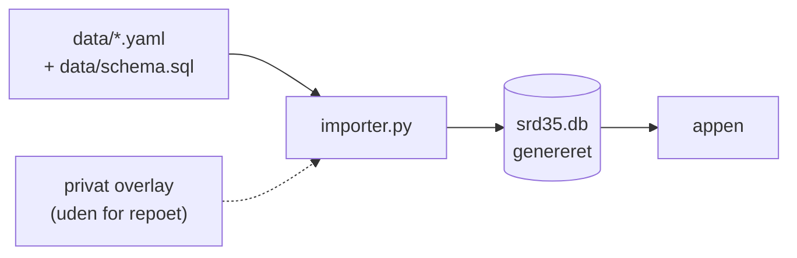

# flask-dnd-3.5

En tablet-først webapp til **D&D 3.5**: karakterark der regner selv, og et
DM-modul med bestiar, eventyr og kampstyring. Kører som systemd-tjeneste på
[dnd.mkuv.dk](https://dnd.mkuv.dk).

<div class="grid cards" markdown>

-   :material-sitemap: **[Arkitektur](arkitektur/index.md)**

    Hvordan koden hænger sammen: lagene, dataflowet, regelmotoren, datamodellen
    og alle 81 ruter. Start her hvis du skal *ændre* noget.

-   :material-server: **[Drift](drift/index.md)**

    Hvor appen kører, hvordan den deployes, og hvordan kode og data er adskilt.

</div>

!!! info "Under opbygning"
    Brugervejledning, beslutningslog (ADR) og de resterende drift-sider er
    beskrevet i briefs under `briefs/` og bygges etapevist. Denne side og
    arkitektur-afsnittet er færdige og aktuelle.

## Hvad appen kan, kort

| Område | Indhold |
|---|---|
| Karakterark | Ability scores, saves, HP-tracker, conditions, skills med synergi, feats, inventar |
| Regelmotor | Afledte tal beregnes ved hver visning — totaler gemmes **aldrig** |
| Magi | 499 spells, forberedelse, spontane castere, varigheder, aktive effekter |
| Ledsagere | Animal companion, familiar, Summon Monster/Nature's Ally I–IX, wild shape |
| DM-modul | Bestiar på 95 monstre, eventyr som Markdown, kampbræt, fælder, døre, loot |
| Data | 19 tabeller, ~2.000 SRD-rækker, seedet fra YAML |

## To ting der er værd at forstå med det samme

Begge er valg der går igen overalt i koden, og de forklarer hvorfor appen ser ud
som den gør.

### 1. Beregnede tal gemmes aldrig

Et karakterarks YAML-fil indeholder kun *grunddata*: ability scores, niveau,
udstyr, feats, aktive effekter. Alt afledt — angrebsbonus, AC, save-totaler,
bæreevne, spell-slots — regnes ved hver enkelt visning.

Det betyder at når en regel rettes, er **alle** karakterer rettet ved næste
sideopdatering. Der findes ingen gemte totaler der kan blive uenige med
reglerne. Prisen er at intet må caches; det er bevidst betalt.

### 2. Databasen er genereret, ikke redigeret

`srd35.db` er git-ignoreret og bygges fra bunden af `importer.py`. Kilden til
sandheden er de deklarative filer i `data/`.



Vil du rette en spell, retter du YAML-filen og reseeder — ikke databasen. Se
[dataflow](arkitektur/dataflow.md) for det fulde billede, inklusive de 11
datafiler der **ikke** går gennem databasen.

!!! warning "Privat indhold hører ikke i dette repo"
    Repoet er offentligt og indeholder kun OGL-materiale. Egne NPC'er, monstre og
    fælder ligger i et **privat overlay uden for repoet** — se
    [dataflow](arkitektur/dataflow.md#det-private-overlay).

## Kom i gang lokalt

```bash
./run-local.sh            # → http://localhost:5000 (auto-reload)
./run-local.sh --fresh    # nulstil lokal test-tilstand + srd35.db
```

Og denne dokumentation:

```bash
./docs/serve.sh           # → http://localhost:8000 (live-reload)
```

## Licens

SRD-indhold er **Open Game Content** under
[Open Game License v1.0a](https://github.com/MikkelKristiansen/flask-dnd-3.5_ynh/blob/main/OGL.txt).
Se OGL afsnit 15 i repoets `OGL.txt` for fuld attribution.
